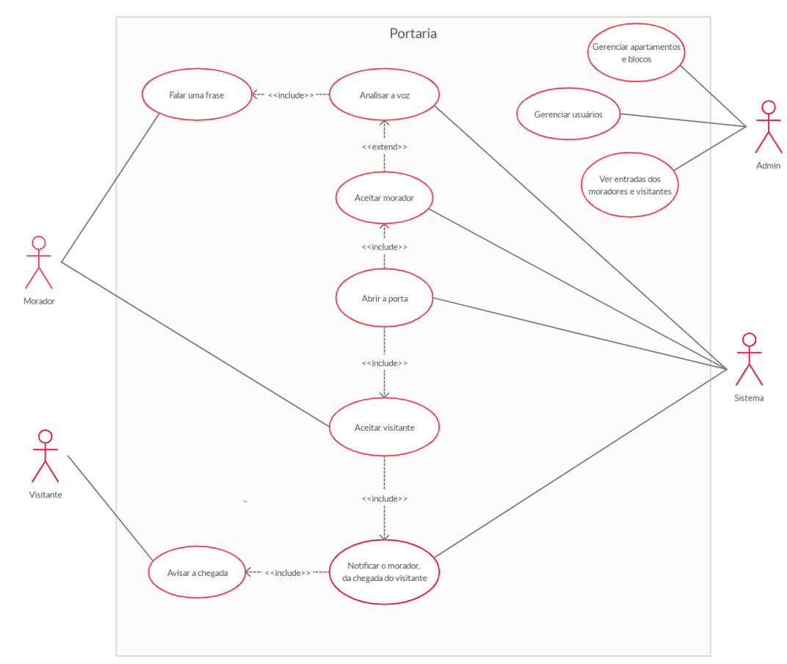
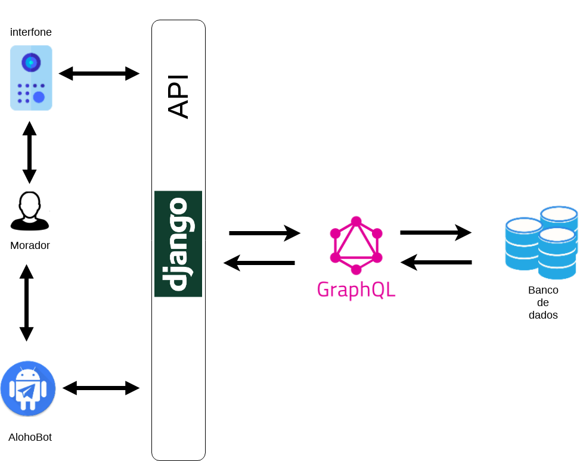
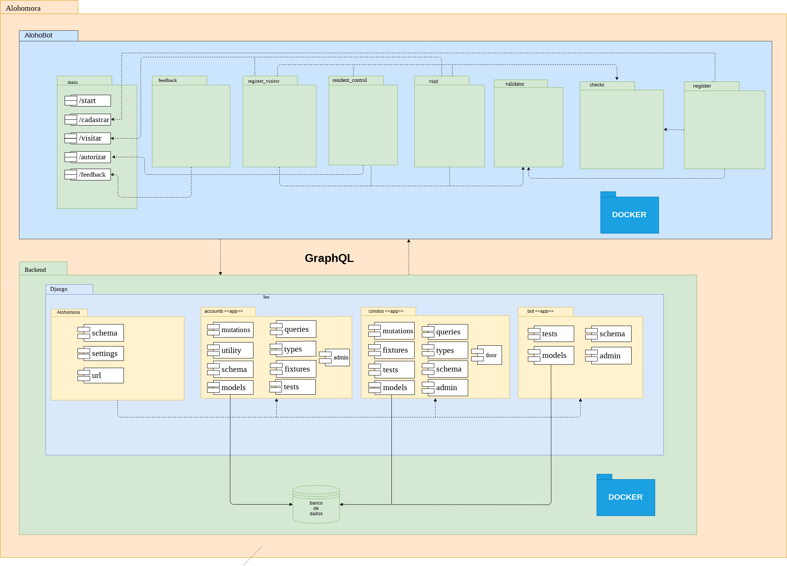

# Alohomora - Portaria Virtual

### Arquitetura
#### Versão 1.0

## Histórico de Revisão
| Data         |  Versão  |                        Descrição                        |   Autor  |
| ------------- | ----------- | ---------------------------------------------------- | ---------- |
|  26/09/2019  | 1.0 | Criação da primeira versão do documento | Paulo Batista, Rodrigo Lima, Victor Gonçalves |
|  01/10/2019  | 1.1 | Revisão de erros ortográficos e sintaxe | João Luis Baraky, Victor Jorge Gonçalves |
| 06/10/2019 | 1.2 | Incremento de uma explicação básica do que é significa MVT | Rodrigo Lima, João Luis Baraky |
| 07/10/2019 | 1.2 | Adição dos objetivos, diagramas de pacotes e relações e melhoria no topico 5| João Luis Baraky, Rodrigo Lima |
| 30/10/2019 | 1.3 | Revisão do documento | Mateus Nóbrega |
| 09/11/2019 | 1.3 | Adição de alguns diagrama e atualização de outros| Matheus Nóbrega, Paulo Batista|

## Sumário
__[1. Introdução](#1-introducao)__ \
[1.1 Objetivo](#11-objetivo) \
[1.2 Escopo](#12-escopo) \
[1.3 Definições, Acrônimos e Abreviações](#13-definicoes-acronimos-e-abreviacoes) \
[1.4 Referências](#14-referencias)

__[2. Representação da Arquitetura](#2-representacao-da-arquitetura)__ \
[2.1 Django](#21-django) \
[2.1.1 MVT](#211-mvt)\
[2.2 GraphQL](#22-graphql) \
[2.2.1 Graphene-Python](#221-graphene-python) \
[2.2.2 Graphene-Django](#222-graphene-django)
<!---[2.3 Vue.js](#23-vuejs) -->

__[3. Objetivos e Restrições da Arquitetura](#3-objetivos-e-restricoes-da-arquitetura)__ \
[3.1 Objetivos](#31-objetivos) \
[3.2 Restrições](#32-restricoes)

__[4. Visão de Casos de Uso](#4-visao-de-casos-de-uso)__ \

__[5. Visão Lógica](#5-visao-logica)__ \
[5.1 Visão Geral](#51-visao-geral) \
[5.2 Diagrama de Relações](#52-diagrama-de-relacoes) \
[5.2.1 Responsabilidades por etapa](#521-responsabilidades-por-etapa) \
[5.3 Diagrama de pacotes](#53-diagrama-de-pacotes)
__[6. Visão de implementação](#6-visao-de-implementacao)__ \
[6.1 Diagrama das models](#61-diagrama-das-models)

__[7. Qualidade](#7-qualidade)__

## 1. Introdução
### 1.1 Objetivo
Este documento pretende mostrar a arquitetura utilizada da portaria virtual Alohomora, mostrar aos envolvidos cada parte da aplicação e transmitir aos interessados as decisões arquiteturais que foram tomadas.

### 1.2 Escopo
Este documento fornece uma visão da arquitetura do Alohomora, um sistema de portaria virtual.
Alohomora é um projeto realizado para as disciplinas Métodos de Desenvolvimento de Software (MDS) e Engenharia de Produto de Software (EPS), do curso de Engenharia de Software da Faculdade UnB Gama (FGA) da Universidade de Brasília (UnB).

### 1.3 Definições, Acrônimos e Abreviações
| Acrônimo/Abreviação | Definição |
| ----------------------------- | ------------ |
| API | Application Programming Interface |
| MDS | Métodos de Desenvolvimento de Software |
| EPS | Engenharia de Produto de Software |
| MVT | Model, View, Template |

### 1.4 Referências
Sistema de Registro em Curso - Documento de Arquitetura de Software; Disponível em: [http://mds.cultura.gov.br/extend.formal_resources/guidances/examples/resources/sadoc_v1.htm](http://mds.cultura.gov.br/extend.formal_resources/guidances/examples/resources/sadoc_v1.htm). Acesso em: 26 de setembro de 2019.

PATROCÍNIO, Sofia; GOUVEIA, Micaella; PEREIRA, Samuel; TAIRA, Luis; MUNIZ, Amanda. Chatbot Gaia: Arquitetura. Disponível em: [https://github.com/fga-eps-mds/2019.1-Gaia/blob/master/docs/projeto/DocArquitetura.md](https://github.com/fga-eps-mds/2019.1-Gaia/blob/master/docs/projeto/DocArquitetura.md). Acesso em: 26 de setembro de 2019.

Padrões Arquiteturais MVC X Arquitetura do Django; Disponível em: [https://github.com/fga-eps-mds/A-Disciplina/wiki/Padr%C3%B5es-Arquiteturais---MVC-X-Arquitetura-do-Django](https://github.com/fga-eps-mds/A-Disciplina/wiki/Padr%C3%B5es-Arquiteturais---MVC-X-Arquitetura-do-Django). Acesso em: 05 de outubro de 2019.

HIROSHI, Lucas; MARQUES, Guilherme; RODRIGUES, Natália; BORGES, Felipe; NÓBREGA, Mateus. ReceitaMais - Documento de Arquitetura. Disponível em: <https://github.com/fga-eps-mds/2017.2-Receita-Mais/wiki/Documento-de-Arquitetura>. Acesso em: 30 de outubro de 2019.

GraphQL vs REST: Overview; Disponível em: <https://phil.tech/api/2017/01/24/graphql-vs-rest-overview/>. Acesso em: 30 de outubro de 2019.

Why use GraphQL, good and bad reasons. Disponível em: <https://honest.engineering/posts/why-use-graphql-good-and-bad-reasons>. Acesso em 30 de outubro de 2019.

## 2. Representação da Arquitetura

### 2.1 Django
Django é uma framework web escrita em Python que encoraja o desenvolvimento rápido e organizado. A framework enfatiza a reusabilidade e conectividade de componentes, assim, diminuindo a quantidade de código e facilitando a criação de sistemas mais complexos. No Django, é utilizada a  arquitetura Model-View-Template (MVT), que é uma variação da arquitetura Model-View-Controller (MVC).

#### 2.1.1 MVT
* Model - É a parte que define o banco de dados, suas classes e como elas se comportam, métodos para manipulação do banco de dados e as validações aplicáveis (regras de negócio).
* View - É a ponte de comunicação entre a Model e a Template. É nela que há o tratamento de informações recebidas e o retorno para o usuário.
* Template - É a parte da interface do usuário. Contém as informações enviadas pela *View* e define como serão apresentadas essas informações, além de comunicar para ela as informações enviadas pelo usuário.

### 2.2 GraphQL
GraphQL é uma linguagem de busca e de manipulação de dados para APIs que permite o usuário estruturar os dados que ele necessita. A linguagem oferece uma flexibilidade e uma maior facilidade em lidar com APIs mais complexas do que outras soluções. A gama de funcionalidades contribui na eficiência e velocidade no desenvolvimento de aplicações.

#### 2.2.1 Graphene
Graphene Python é uma biblioteca que oferece as ferramentas necessárias para implementar uma API GraphQL em Python. Ela permite que os dados que o seu serviço providenciará sejam definidos usando código Python.

### 2.3 Telegram

Telegram é uma aplicação multiplataforma de troca de mensagens instantâneas baseada na nuvem. Focada em segurança e performance, permite que o usuário envie texto, imagens, fotos, mensagens de áudios e arquivos de qualquer tipo. Ele também providencia uma API para que desenvolvedores possam implementar bots que interajam com usuários.

<!---
#### 2.3.2 Graphene-Django
Graphene-Django é construído em cima do Graphene. Fornece uma camada de abstração adicional que torna mais fácil implementar GraphQl em um projeto Django.

### 2.4 Vue.js
Vue é um framework progressivo do JavaScript de código aberto para construir interfaces de usuários. Diferente de outros frameworks, Vue é projetado desde o ínicio para ser adotável de forma incremental. O Vue também pode funcionar como uma estrutura de aplicativos web capaz de alimentar aplicativos avançados de um única página.
-->

## 3. Objetivos e Restrições da Arquitetura

### 3.1 Objetivos
- O sistema deve garantir a privacidade dos dados inseridos no banco de dados
- Deve ser possível estruturar o condomínio (blocos e apartamentos) e cadastrar moradores manualmente;
- Fornecer a funcionalidade de autenticação de usuário, morador e visitante, via voz;
- É necessário ter uma comunicação com o morador com o intuito de notificar a chegada de um visitante;
- O morador deverá ter o poder se permitir ou não a entrada de um visitante que o referencia.

### 3.2 Restrições
- O hardware deve estar conectado a internet.
- O sistema deve estar integrado ao banco de dados para a autenticação dos usuários.
- O sistema deve estar integrado a um bot no Telegram para interação com os usuários.
- Os usuários moradores devem ter o aplicativo Telegram instalado e internet para a comunicação com o sistema via bot.
- O hardware deve ter um microfone para a gravação de voz, pois precisa-se da voz para a autenticação.

## 4, Visão de Casos de Uso
Os casos de uso relevantes para a arquitetura são:

- Falar uma frase
- Analisar a voz
- Aceitar morador
- Abrir porta
- Aceitar visitante
- Notificar o morador da chegada do visitante
- Avisar a chegada
- Gerenciar apartamentos
- Gerenciar usuários
- Ver entradas dos moradores e vistantes

## 5. Visão Lógica
### 5.1 Visão Geral
A portaria virtual Alohomora está sendo construída em Django, utilizando da ferramenta de busca GraphQL, integrada com Graphene-Django. O objetivo principal ao usar o Django é ter uma organização que facilite o trabalho e a adaptação do grupo. O GraphQL fornece velocidade na busca de dados e eficiência.

### 5.2 Diagrama de Relações

O morador interage com o AlohoBot para requisitar ou modificar alguma informação, e interage também com o interfone para fazer a autenticação por voz. Nos quais requisitam algum tipo de ação do sistema, assim a API processa a ação requirida.
O graphQL a partir das mutations e queries, é o responsável por buscar e modificar as informações através da comunicação com a model, esta que se comunica com o banco de dados, e retorna o resultado para o bot ou interfone.

### 5.2.1 Responsabilidades por etapa

A etapa de comunicação do usuário com o AlohoBot deve conter não apenas classes responsáveis pelos componentes gráficos e visuais, mas também deve guardar as informações do usuário no banco de dados. Dessa forma, o código do bot está desacoplado com o da API.

No AlohoBot vai ser feito um request em forma de json para o graphql buscar ou modificar as informações no banco de dados. Pois no graphql é necessário que seja provido o corpo do JSON informando se vai estar performando uma query ou mutation. Apartir disso, já é possível retornar para o cliente as informações.

No alohobot ou interfone, a voz do usuário vai ser transformada pelo verto de características da voz e passado para o algoritmo fastdtw na API, e então a API vai falar se a voz realmente pertence ao usuário. 
<!--
Essa comunicação do AlohoBot com a API é protegida por um token.
Na e tapa de comunicação do usuário com o interfone vai ser feita com o uso de uma interface de comunicação baseado no Home Assistant que permite a sua integração com dispositivos de IoT. A partir do iot tem uma comunicação direta com a API, no qual a voz do usuário vai ser transformada pelo vetor de características da voz e passado para o algoritmo fastdtw, e então permitindo ou não a entrada do morador.
-->

### 5.3 Diagrama de Pacotes

## 6. Visão de implementação
### 6.1 Diagrama das models

## 7. Qualidade
- Utilização de algorítimos otimizados para autenticação de usuário pelas voz.
- Utilização de boas práticas no desenvolvimento do projeto.
- Utilização de ferramentas que garantem velocidade e produtividade, como o GraphQL e Django.
- Facilidade para integração com outras bibliotecas e serviços.
- Fornecer um produto final o mais eficiente e otimizado possível.
